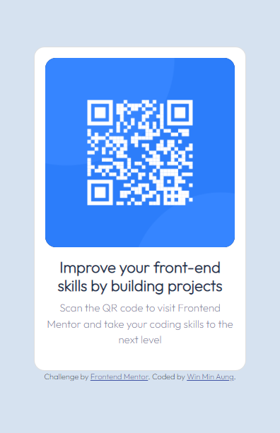

# Frontend Mentor - QR code component solution

This is a solution to the [QR code component challenge on Frontend Mentor](https://www.frontendmentor.io/challenges/qr-code-component-iux_sIO_H). Frontend Mentor challenges help you improve your coding skills by building realistic projects.

## Table of contents

- [Overview](#overview)
  - [Screenshot](#screenshot)
  - [Links](#links)
- [My process](#my-process)

  - [Built with](#built-with)
  - [What I learned](#what-i-learned)
  - [Continued development](#continued-development)

- [Author](#author)
- [Acknowledgments](#acknowledgments)

## Overview

first time was like a shit
but I have trying second times
I think second times is good
what u think? Is it good?

### Screenshot

### Links

- Solution URL: [My solution](https://github.com/wminaung/000-FrontendMentor.git)
- Live Site URL: [000-frontend-mentor-quylzf076-wminaung.vercel.app](https://000-frontend-mentor-quylzf076-wminaung.vercel.app/)

## My process

create parent div for hold all div
sorry! I don't know how to describe
My english is too bad.

### Built with

- Semantic HTML5 markup
- CSS custom properties
- Flexbox
- CSS Grid
- Mobile-first workflow
- [Bootstrap](https://getbootstrap.com/) - For styles

### What I learned

I need to learn more and more...

### Continued development

Now I'm learning heml,css,javascript
My dream is too big , I want to create AI dimension like in SAO anime.
It just a dream but I believe one day I can it

## Author

- Website - [Win Min Aung](https://github.com/wminaung)
- Frontend Mentor - [@wminaung](https://www.frontendmentor.io/profile/wminaung)
- Twitter - [@WinMinA36040918](https://twitter.com/WinMinA36040918)

## Acknowledgments

thanks to all
